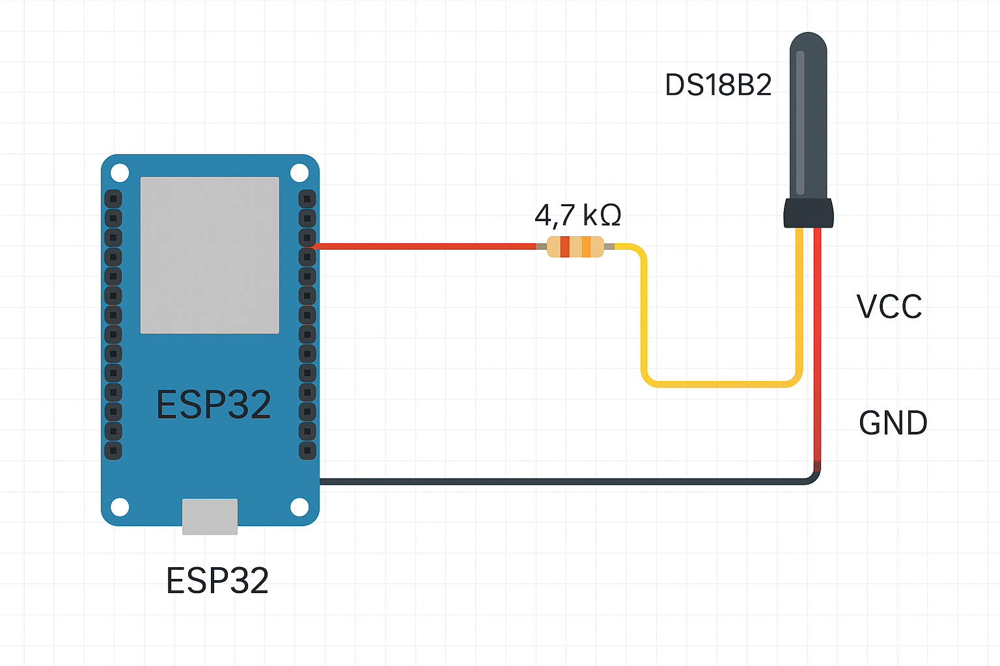

# ESP32 Temperature Monitoring with DS18B20 and Python Database Integration

This project demonstrates how to use an ESP32 microcontroller with a DS18B20 temperature sensor to monitor temperature data and push it to a local database using a Python program and XAMPP.

## Overview

- **Hardware:** ESP32, DS18B20 temperature sensor
- **Software:** Arduino IDE (for ESP32), Python, XAMPP (Apache, MySQL, PHP)
- **Functionality:** The ESP32 reads temperature data from the DS18B20 sensor and sends it over Wi-Fi to a Python script running on a local server. The Python script receives the data and inserts it into a MySQL database managed by XAMPP.

## Workflow

1. **Sensor Reading:**  
    The DS18B20 sensor is connected to the ESP32, which reads the temperature at regular intervals.

2. **Data Transmission:**  
    The ESP32 connects to the local Wi-Fi network and sends the temperature data via HTTP POST requests to the server.

3. **Python Server:**  
    A Python script (using Flask or similar) runs on the local machine, receives the POST requests, parses the temperature data, and inserts it into the MySQL database.

4. **Database Storage:**  
    XAMPP provides the MySQL database where all temperature readings are stored with timestamps for later analysis.

## Features

- Real-time temperature monitoring
- Reliable data logging in a local database
- Easy integration with web dashboards or data analysis tools

## Applications

- Home automation and climate control
- Data logging for scientific experiments
- Industrial temperature monitoring

## Requirements

- ESP32 development board
- DS18B20 temperature sensor
- Jumper wires and breadboard
- Arduino IDE with necessary libraries
- Python 3 with Flask and MySQL connector
- XAMPP installed and configured

## Example Database Table

```sql
CREATE TABLE temperature_readings (
     id INT AUTO_INCREMENT PRIMARY KEY,
     temperature FLOAT NOT NULL,
     timestamp DATETIME DEFAULT CURRENT_TIMESTAMP
);
```

## Next Steps

- Set up the hardware and upload the ESP32 code
- Configure the Python server and database
- Visualize or analyze the collected data




